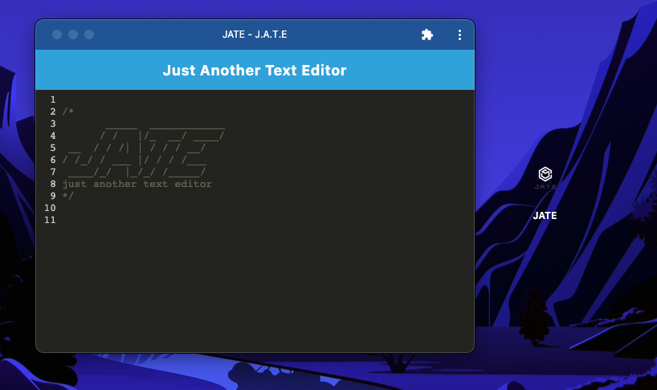

# Text Editor

## Table of Contents
- [Description](#description)
- [Installation](#installation)
- [Usage](#usage)
- [License](#license)
- [Contributing](#contributing)
- [Questions](#questions)

## Description
This app edits text.

## Installation
Go to the running heroku website and click install at the top.

## Usage
Allows the user to enter text and edit however they see fit.

## License
Distributed under the MIT License.

## Contributing
Steve Weede

## Questions
Please send questions to:
steveweede@yahoo.com or to BabyStu at Github